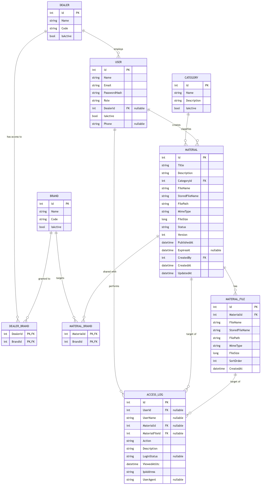
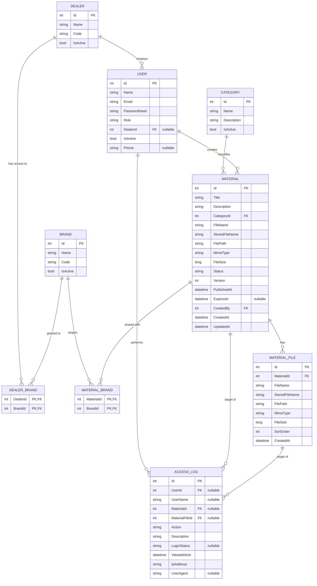

# ER Diyagramı

`backend/src/BayiPortal.Core/Entities/*.cs` içindeki gerçek entity/ilişki tanımlarından
çıkarıldı (2026-07-22, `MaterialFile` eklendi). `README.md`'deki kavramsal veri modeliyle
küçük farklar olabilir — buradaki diyagram kod ile birebir eşleşir.

Aşağıdaki Mermaid kaynağından üretildi (`@mermaid-js/mermaid-cli` ile PNG'ye render
edildi). Diyagramı güncellemek için bu kod bloğunu düzenleyip yeniden render edin.

## Notlar

- `DEALER_BRAND` ve `MATERIAL_BRAND`, composite PK'lı (`DealerId+BrandId`,
  `MaterialId+BrandId`) çoktan-çoğa köprü tablolar — bayi/marka ve materyal/marka
  eşleşme kuralının (`DealerBrands ∩ MaterialBrands ≠ ∅`) veritabanı karşılığı.
- `AccessLog.UserId` / `AccessLog.MaterialId` **nullable FK** — PR #9
  (`feature-backend-bayiGirisLog`) ile sistem geneli loglama için ilişkiler
  opsiyonel hale getirildi (örn. materyali olmayan başarısız giriş denemesi).
- `User.Role` (`string`) ve `Material.Status` (enum-backed `string` kolon) ayrı bir
  lookup tablosuna FK değil — `TODO.md`'deki "hâlâ string kullanıyor" notuyla
  tutarlı.
- `Material.Version`, `AddVersionToMaterials` migration'ı ile eklendi; her
  `UpdateAsync`'te `+1` artırılır (bkz. `feature-backend-dokuman-goruntulenme-sayaci`,
  PR #17).
- `User.Phone` (nullable), `AddPhoneToUsers` migration'ı ile eklendi.
- `MATERIAL_FILE`, `AddMaterialFiles` migration'ı ile eklendi (bir materyal artık birden
  fazla dosyaya sahip olabilir). `MATERIAL`'in eski tekil dosya kolonları
  (`FileName`/`StoredFileName`/`FilePath`/`MimeType`/`FileSize`) geriye dönük uyumluluk
  için kasıtlı olarak korundu ve migration'daki backfill ile mevcut materyallerin dosyası
  birer `MATERIAL_FILE` satırına kopyalandı — "ilk dosya" özeti olarak dolu kalmaya devam
  ediyorlar, kaynak artık `MATERIAL_FILE`.
- `ACCESS_LOG.MaterialFileId` (nullable FK, `SetNull`), aynı migration'la eklendi; hangi
  dosyanın görüntülendiğini/indirildiğini materyal-geneli değil dosya bazında izlemeyi
  sağlar. Geçmiş loglarda bu alan `NULL` kalır (geriye dönük eşleme yapılmadı).
